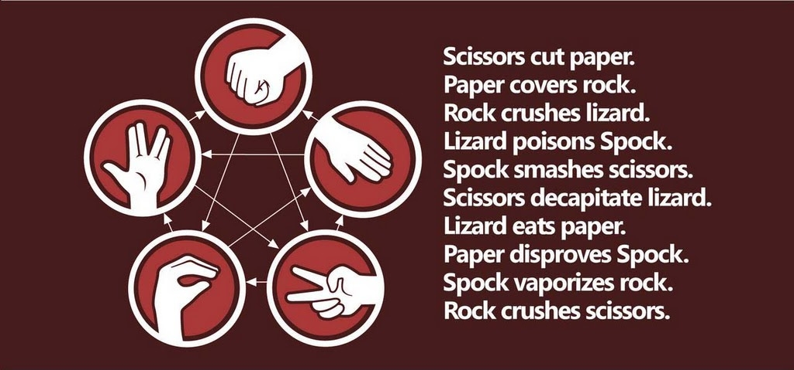

# Rock, Paper, Scissors, Lizard, Spock game in vanilla JS

## Project Description

This repository is a Rock, Paper, Scissors, Lizard, Spock game that I built to practice my Vanilla JavaScript skills.

Rock, Paper, Scissors, Lizard, Spock is a game invented by <a href='http://www.samkass.com/theories/RPSSL.html' target="_blank">Sam Kass</a> and <a href="http://www.karenbryla.com/" target="_blank">Karen Bryla</a> as an improvement on the classic Rock-Paper-Scissors game due to the fact that when you know someone well enough, 75-80% of any Rock-Paper-Scissors games you play with that person end up in a tie.

##### Rules:
  
You can play this game vs the computer <a href="https://codesandbox.io/s/rpsls-vanilla-js-lgn5e?file=/src/index.js">here</a>.
 You make a selection, the computer will make a random selection and then reveal the result of the choices: You win, Computer wins or It's a draw.
 

I have documented the code in the `index.js` with comment blocks.

In the future, I would like to update this project to use WebSockets to allow two human players to play against each other. Feel free to fork the repo and make any additions/improvements as desired.

## Key JavaScript Functions/Methods Used

- `const` (no `let` or `var` variable declarations), MDN documentation: https://developer.mozilla.org/en-US/docs/Web/JavaScript/Reference/Statements/const
- `arrow functions` (no `function` keyword), MDN documentation: https://developer.mozilla.org/en-US/docs/Web/JavaScript/Reference/Functions/Arrow_functions
- `array`, MDN documentation: https://developer.mozilla.org/en-US/docs/Web/JavaScript/Reference/Global_Objects/Array
- `Template literals`, MDN documentation: https://developer.mozilla.org/en-US/docs/Web/JavaScript/Reference/Template_literals
- `document.querySelector`, MDN documentation - https://developer.mozilla.org/en-US/docs/Web/API/Document/querySelector
- `document.innerHTML`, MDN documentation - https://developer.mozilla.org/en-US/docs/Web/API/Document/innerHTML
- `document.innerText`, MDN documentation - https://developer.mozilla.org/en-US/docs/Web/API/Document/innerText
- `document.createElement`, MDN documentation - https://developer.mozilla.org/en-US/docs/Web/API/Document/createElement
- Array method `forEach`, MDN documentation - https://developer.mozilla.org/en-US/docs/Web/JavaScript/Reference/Global_Objects/Array/forEach
- Array method `.length`, MDN documentation - https://developer.mozilla.org/en-US/docs/Web/JavaScript/Reference/Global_Objects/Array/length
- `Math.floor`, MDN documentation - https://developer.mozilla.org/en-US/docs/Web/JavaScript/Reference/Global_Objects/Math/floor
- `Math.random`, MDN documentation - https://developer.mozilla.org/en-US/docs/Web/JavaScript/Reference/Global_Objects/Math/random
- `Switch`, MDN documentation - https://developer.mozilla.org/en-US/docs/Web/JavaScript/Reference/Statements/switch
- `addEventListener('click')`, MDN documentation - https://developer.mozilla.org/en-US/docs/Web/API/Document/addEventListener
- `appendChild`, MDN documentation - https://developer.mozilla.org/en-US/docs/Web/API/Node/appendChild
- `event.target`, MDN documentation - https://developer.mozilla.org/en-US/docs/Web/API/Event/target

##### TODO:

- Improve CSS styling to the game
- Use Websockets to add two human player functionality

## How to develop locally on your computer

1. Fork this repository
2. Clone to your local machine
3. `yarn install` in your terminal to install dev dependencies for development
4. `yarn dev` to start Parcel dev server

## How to build for production

1. `yarn build` to have Parcel Bundler compile a production version of the app

## Feedback

If you have any feedback of issues running the project or potential additions/improvements, please feel free to create a new issue to this repository or send me a message on Linkedin <a href=https://www.linkedin.com/in/benjamin-chacko-58125060/>here</a>
